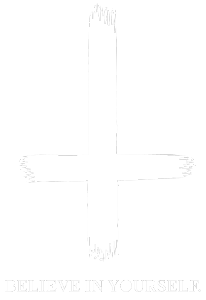

  

  <h1>♰ JESUS COLMENARES ♰</h1>

  

    <samp><strong>— ♰ NAILED, DEAD, RISEN ♰ —</strong></samp>
  

  

    <em>Software Developer · Systems Architecture · Clean Code</em> 
    "In tenebris lux, in codice ordo."
  

   

  

  <h3>♰ 01 // MANIFESTO ♰</h3>

  

    ♰ <strong>Location:</strong> Remote / Void &nbsp;·&nbsp;
    ♰ <strong>Focus:</strong> Low-Level Systems, Backend & Automation &nbsp;·&nbsp;
    ♰ <strong>Philosophy:</strong> Minimalist & Brutalist
  

  

    Desarrollador de software enfocado en construir herramientas sólidas, código estructurado y arquitecturas de alto rendimiento. 
    Apasionado por la precisión del bajo nivel, la ingeniería limpia y la estética oscura.
  

   

  

  <h3>♰ 02 // TECHNICAL ARSENAL ♰</h3>

  
<strong>Core Languages</strong>

  

    
    
    
    
    
    
  

  
<strong>Environment & Tooling</strong>

  

    
    
    
    
  

   

  

  <h3>♰ 03 // SANCTUARY & CONTACT ♰</h3>

  

    
  

   

  

    ♰ · · · M E M E N T O &nbsp; M O R I · · · ♰
  

